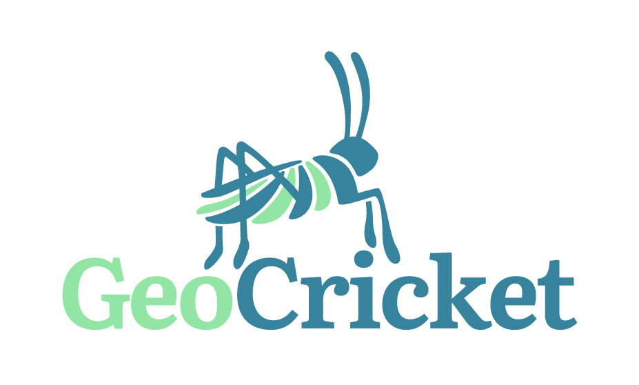
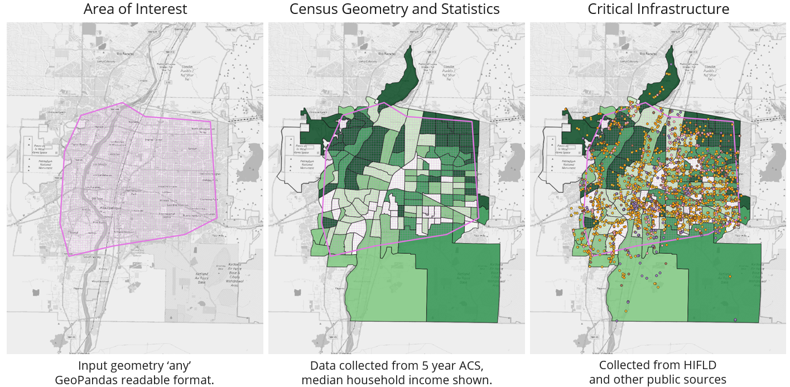

# GeoCricket
The **Geo**spatial **Cr**itical **I**nfrastructure and **C**ensus Data Stoc**k**pil**e** **T**ool 
(GeoCricket) is a collection of functions that collect critical 
infrastructure and Census data for use in ReNCAT, QGIS Social Burden 
Calculator, or can act to infrom other place based work.

Current available servers:
* TigerWeb (Census Geometry)
* TigerWeb (ACS statistics)
* HIFLD (Infrastructure)

Current supported output file types:
* shp
* gpkg
* kml
* csv

# Disclaimer
Due to GeoCricket's reliance on external sources that may change location or availability over time, 
parts of this package may break as those elements are changed remotely.

## Visuals
Starting with any GeoPandas readable format, census geometry and statistics,
and HIFLD critical infrastructure can be collected.



## Installation Process
The install described utilizes an anaconda virtual environment, and may
not be applicable to all situations, but has been known to work.

* Process seems to go smoother help if 'installation' console/terminal 
window is opened in administrator mode.

* VPNs have also been known to cause installation issues.

1. Create new anaconda environment:
```
conda create -n <ENV NAME> 
conda activate <ENV NAME> 
```

2. Execute `conda install pip` from new environment 
for simple intialization of python.

3. Execute `pip install -e .` from main repo directory to install 
package and allow modifications to be applied to the code without 
re-installation.  

Note: If there are issues with packages not matching
hashes in 'the requirements file', Execute `python -m pip cache purge`
and try to install again. 

4. Execute `conda install ipykernel` so that Jupyter Notebook demos 
can run.


## Usage
Demos located in the demo folder. 

Census API keys available here: `https://api.census.gov/data/key_signup.html`

Ideally, a single polygon describing an area of interest is passed into 
a single function that then outputs all collected data
in usable file formats.

## Support
Created by Thad Haines - jthaine@sandia.gov.

## Contributing
Open and ongoing.

## Authors and Acknowledgment
Package / setup.py / gitignore adapted from Will Vining.

Utilizes the restapi package from https://github.com/Bolton-and-Menk-GIS/restapi

and the simplekml package https://simplekml.readthedocs.io/en/latest/

## Project Status
The Department of Energy (DOE), by memo dated 05/28/2024, has granted 
National Technology and Engineering Solutions of Sandia, LLC (NTESS) 
permission to assert its copyright in software entitled " GeoCricket " 
and deemed the software to be Publicly Available.

No additional funding exists for this work.
